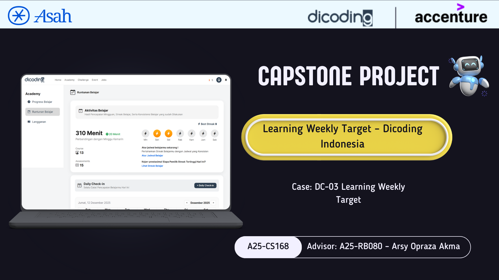

# Learning Weekly Target
Capstone Project – A25-CS168

## Tim Capstone A25-CS168
Use Case Terpilih: DC-03 – Learning Weekly Target

| Cohort ID | Nama | Learning Path |
|----------|------|---------------|
| F171D5X1859 | Siti Nurpadilah | Front-End Web & Back-End with AI |
| F171D5X1860 | Siti Rohmah | Front-End Web & Back-End with AI |
| F171D5Y1089 | Maulana Yusuf | Front-End Web & Back-End with AI |
| F171D5Y2008 | Zainal Arif | Front-End Web & Back-End with AI |
| F171D5Y0841 | Imam Pauzi | Front-End Web & Back-End with AI |

---

## Learning Weekly Target

  

---

## Deskripsi Proyek

Learning Weekly Target adalah aplikasi web yang membantu pengguna memantau konsistensi dan kebiasaan belajar melalui fitur check-in harian, pengaturan jadwal belajar mingguan, streak belajar, serta ringkasan aktivitas belajar.

Proyek ini dikembangkan sebagai bagian dari Capstone / Project Brief Dicoding (ASAH) dengan arsitektur Frontend dan Backend yang terhubung melalui REST API.

---

## Link Deploy

Frontend (Netlify)  
https://learningweeklytarget-a25-cs168.netlify.app/

Backend API (Railway)  
https://backend-production-4d64.up.railway.app

---

## Struktur Proyek

**Frontend**

  

**Backend**

  

---

## Tech Stack

Frontend:
- HTML5
- CSS3
- JavaScript (Vanilla JS)
- FullCalendar
- Bootstrap Icons

Backend:
- Node.js
- Express.js
- Supabase

Deployment:
- Netlify
- Railway

---

## Tautan Dataset (REST API)

Dataset pada proyek ini berbentuk REST API yang digunakan langsung oleh frontend.

https://backend-production-4d64.up.railway.app/api/activity  
https://backend-production-4d64.up.railway.app/api/streak  
https://backend-production-4d64.up.railway.app/api/checkin?userId=1  
https://backend-production-4d64.up.railway.app/api/schedule/1  

---

## Fitur Utama

- Daily Check-in
- Weekly Learning Schedule
- Learning Streak
- Activity Summary
- Learning Reminder

---

## Cara Menjalankan Proyek

1. Clone repository
git clone https://github.com/Yusuf02022002/learningweeklytarget.git

2. Jalankan frontend
Buka file:
Frontend/index.html
atau gunakan Live Server

3. Jalankan backend (opsional)
cd Backend
npm install
npm run dev

Jika backend dijalankan secara lokal, ubah API_BASE di frontend:
const API_BASE = "http://localhost:3000/api";

---

## Video Presentasi

https://youtu.be/OThVNv7O_ZE 

---

## Contact

| Nama | LinkedIn |
|-----|----------|
| Maulana Yusuf |  |
| Siti Nurpadilah |  |
| Siti Rohmah |  |
| Zainal Arif |  |
| Imam Pauzi |  |
